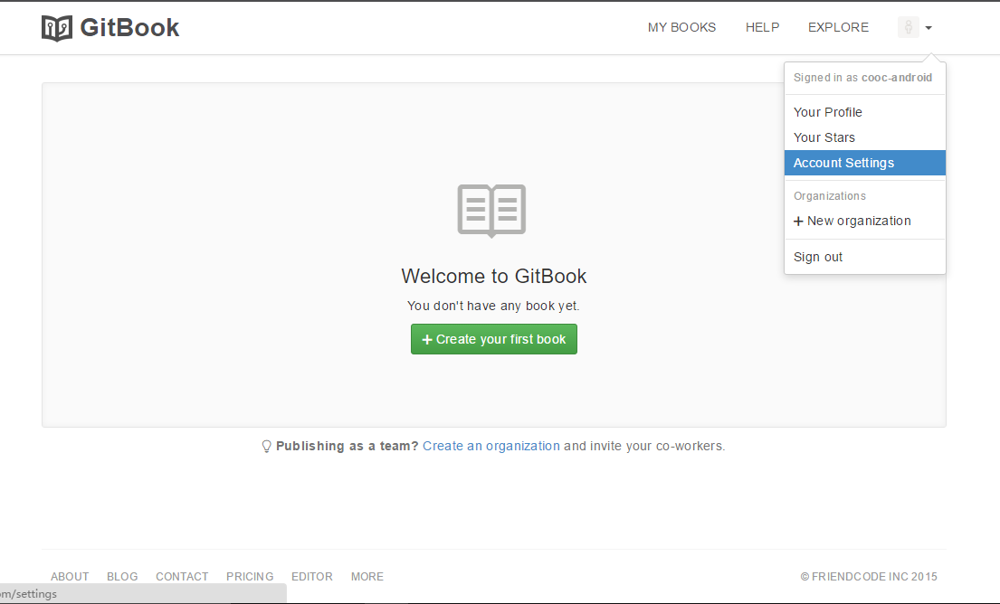
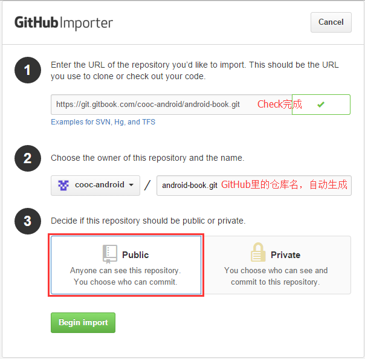

# 使用GitBook编写教材（以Windows平台为例）

## 1.GitBook
GitBook是一个命令行工具(node.js库)， 使用Github/Git创建漂亮的图书。 你可以看一些用它编写的图书的例子： [高效使用 Mac OS X](https://www.GitBook.com/book/prettyxw/mac-os-x-tricks/details). 你也可以很容易的通过[GitBook.io](https://www.gitbook.com)网站发布在线图书。完整的文档可以在[help.gitbook.com](help.gitbook.com)网站找到.   

##输出格式
-------
GitBook可以产生下列类型的图书：

- **静态站点**：默认格式。创建一个完全交互式的静态网站，可以发布到GitHub Pages等网站。
- **eBook**：图书完成后可以使用它创建电子书。创建命令: `GitBook ebook ./myrepo`。你需要安装 [ebook-convert](http://manual.calibre-ebook.com/cli/ebook-convert.html)。输出格式可以是 **PDF**, **ePub** 或 **MOBI**。

##图书结构
-------
一本图书就是一个Git repository， 至少包含两个文件: `README.md` 和 `SUMMARY.md`。

````README.md 是你图书的简介，它可以被自动地加入到最终的 summary 之中
````

```` SUMMARY.md 定义了图书的目录。它应该包含章节的列表，以及它们的链接。
````

例如：

SUMMARY.md

<!-- lang:CSS -->
	# Summary
	This is the summary of my book.
	* [section 1](section1/README.md)
    	* [example 1](section1/example1.md)
	    * [example 2](section1/example2.md)
	* [section 2](section2/README.md)
    	* [example 1](section2/example1.md)
    	  
不被 `SUMMARY.md` 包含的文件不会被 `GitBook` 处理.  

##2.创建GitBook账户
1.打开[GitBook](https://www.gitbook.com)，输入相应信息，点击注册，登录注册邮箱确认。   
   
2.登录你的GitHub账号    
3.进入“账户设置”，关联GitHub   
   
4.在GitHub处选择`With access to public reponsitory`   
   
5.创建一本书   
   
6.将书的仓库与GitHub关联   
   
7.在GitHub的导入页，先点击`Check URL`，等待检查完成，选择`Public`，再点击`Begin import`。   
   
8.在授权页输入GitBook用户名和密码，授权。等待导入完成。       
**现在已经将GitBook上书的仓库和GitHub上书的仓库关联起来了，以后既可以通过GitBook写书，也可以将更新提交到GitHub。下面介绍通过GitBook客户端撰写的方法。**

## 3.安装环境 
1.下载并安装[GitBook客户端](http://downloads.editor.gitbook.com/)   
2.打开GitBook客户端并登录。   
3.点击`GITBOOK.COM`，并点击要编辑的书。
    
4.GitBook还是使用[Markdown](http://wowubuntu.com/markdown/)语法书写，下面介绍编辑面板：
   