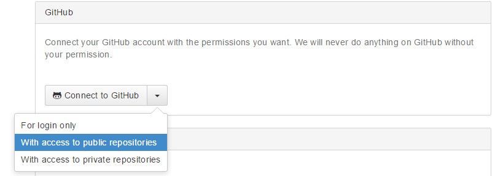
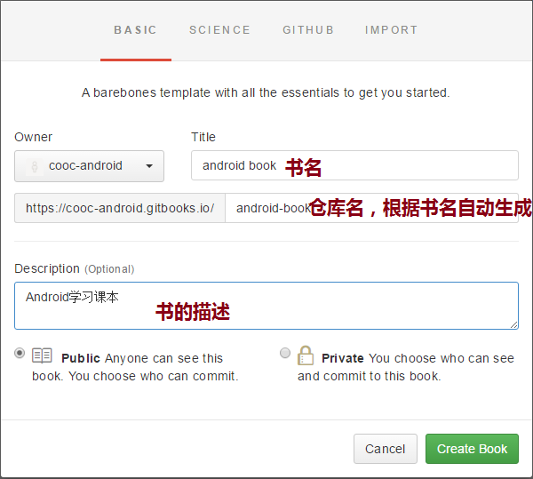
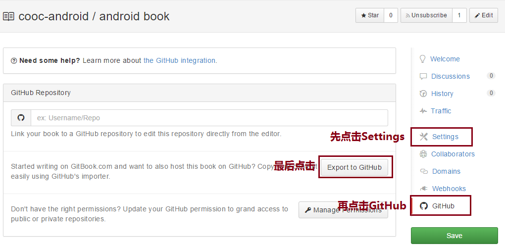
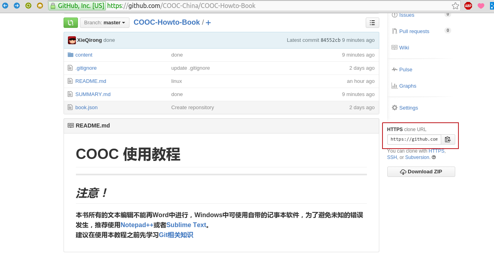

二、创建书并关联GitHub仓库
===
---

1.打开[GitBook](https://www.gitbook.com)，输入相应信息，点击注册，登录注册邮箱确认。   
   
2.新建一个浏览器窗口并登录你的GitHub账号    
3.回到GitBook窗口，进入“账户设置”，关联GitHub   
   
4.在GitHub处选择`With access to public reponsitory`   
   
5.创建一本书   
   
6.将书的GitBook仓库与GitHub仓库关联   
   
7.在GitHub的导入页，先点击`Check URL`，等待检查完成，选择`Public`，再点击`Begin import`。   
   
8.在授权页输入GitBook用户名和密码，授权。等待导入完成。完成后在GitHub里查看远程仓库的地址（图中红色线框处）
          
**现在已经将GitBook上书的仓库和GitHub上书的仓库关联起来了，以后既可以通过GitBook写书，也可以将更新提交到GitHub，极大的方便了多人协作撰写一本课本。**   
**以后就可以通过https://username.gitbook.io/仓库名/ 在线阅读或下载图书。**   
*下面介绍通过GitBook客户端撰写的方法。*