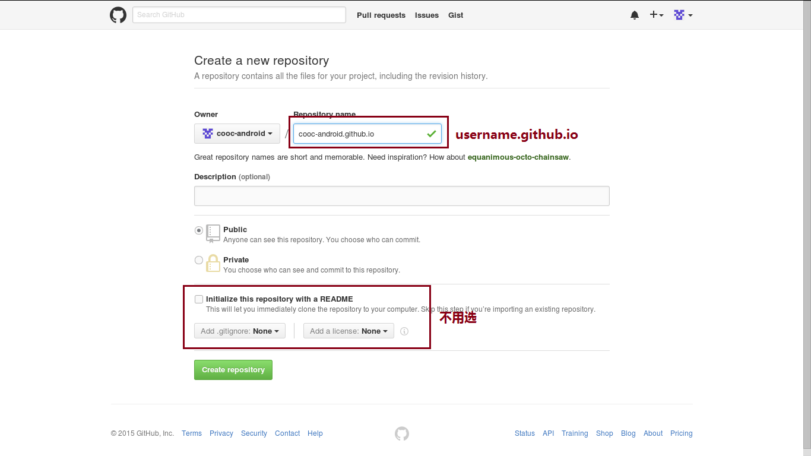
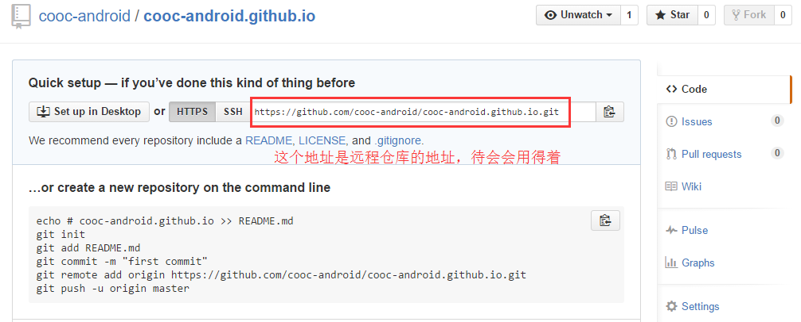
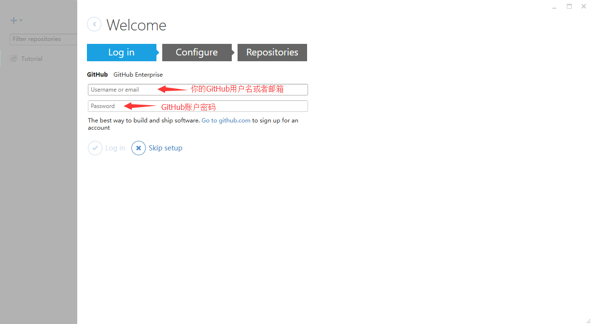
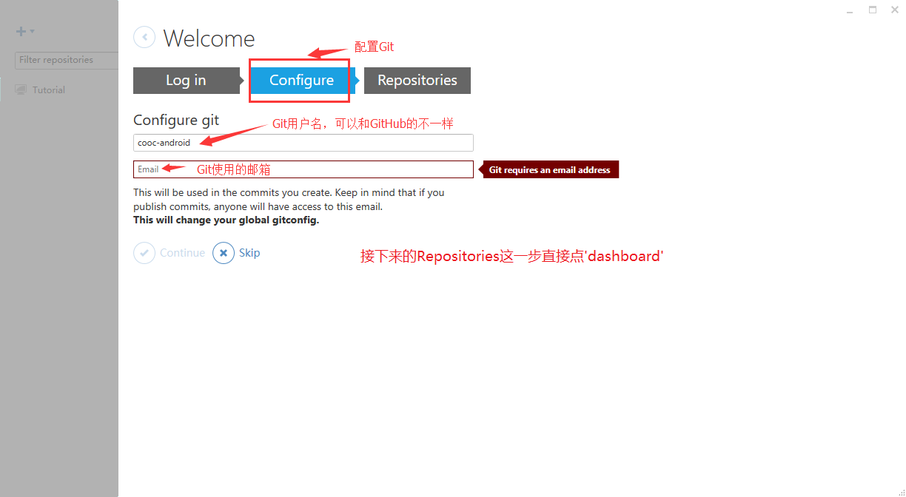
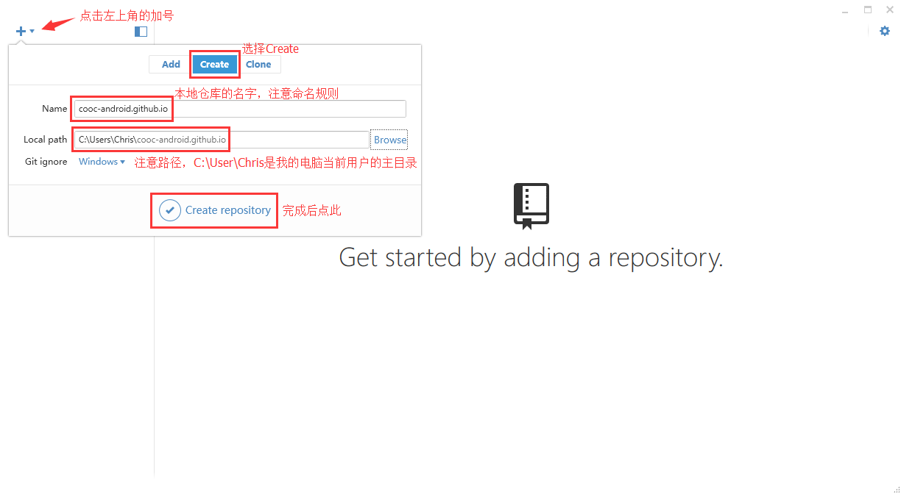
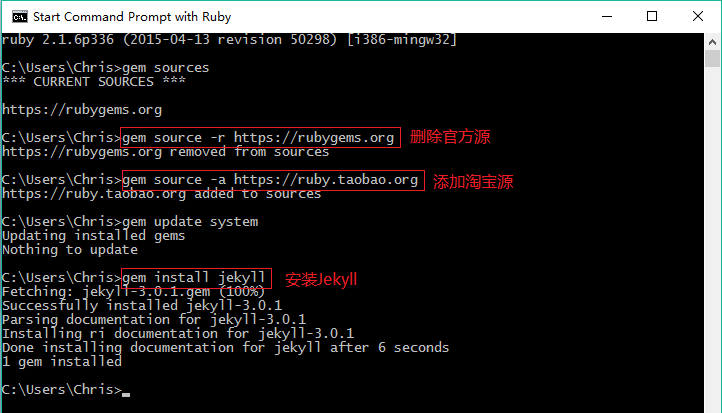

二、环境搭建并创建仓库
====
----

### 安装GitHub并建立仓库
1.打开[GitHub](https://github.com)创建GitHub账户   

2.在GitHub上建立一个远程仓库，仓库名规则：username.github.io（username为你的GitHub用户名）   
   
   
3.下载并安装[GitHub客户端](https://github-windows.s3.amazonaws.com/GitHubSetup.exe)   
4.打开GitHub客户端，输入之前注册的GitHub账号登录，配置你的GIT（此处输入你姓名拼音和你的邮箱），然后点击`dashboard`   
   
   
5.点击左上角的加号，选择`Create`，Name输入：`username.github.io（username为你的GitHub用户名）`，点击`Browse`   定位到“C:\User\电脑当前用户名” 这个文件夹，点击`Create reponsitory`，创建一个本地仓库完成。

### 安装Jekyll
1.下载并安装最新的[Rubyinstaller](http://pan.baidu.com/s/1pJ1UgNT)，注意！安装时勾选`Add Ruby executables to your PATH`，且安装路径不能包含空格。   
2.安装完成后从开始菜单打开`Start Command Prompt with Ruby`   
3.运行`gem sources`查看gem安装源列表   
4.运行`gem source -r 刚才看到的源`删除gem默认的官方源（因为官方源被墙）   
5.运行`gem source -a https://ruby.taobao.org`将官方源改成淘宝源   
6.运行`gem update system`更新一下gem   
7.运行`gem install jekyll`安装Jekyll（安装速度视网速而定，安装完成之后会有相应提示，请耐心等待）   
